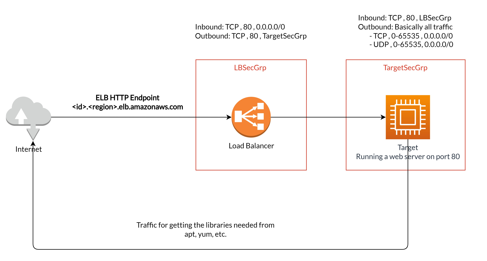

# Project 2 - Deploy a high-availability web app using CloudFormation

## Security Group Definition

There are two types of rules in a security group definition

- **Inbound / Ingress**: Controlling traffic flowing **into** the resource
- **Outbound / Egress**: Controlling traffic flowing **out of** the resource

Remember: **In**bound ⇾ **In**to, **Out**bound ⇾ **Out** of

This is a common traffic example between an Application Load Balancer and a target that's fetching some packages from the internet, which is the case for our project 2

For the ALB / Targets with the following properties

- **ELB Listener** Port: 80
- **Target Group** Port: 80
- Running **App** Port (on the target): 80

We need the following rules for the Load Balancer Security Group

| #   | Affecting properties                | Inbound / Outbound | Protocol, Ports, Source / Destination |
| --- | ----------------------------------- | ------------------ | ------------------------------------- |
| 1   | ELB Listener Port                   | Inbound            | TCP, 80, ALL (0.0.0.0/0)              |
| 2   | Target Group Port, Running App Port | Outbound           | TCP, 80, **Target Security Group**    |

- Rule 1: We need the ELB Listener to listen on port 80 (the default HTTP port) from all sources, this is the inbound rule, this way we can use the normal ELB HTTP endpoint without having to add `:port` section after it
- Rule 2: The only traffic initiating from the ELB is the rerouted traffic to the targets, we can specify the destination by specifying the Security Group associated with it

We need the following rules for the Load Balancer Security Group

| #   | Affecting properties                | Inbound / Outbound | Protocol, Ports, Source / Destination     |
| --- | ----------------------------------- | ------------------ | ----------------------------------------- |
| 1   | Target Group Port, Running App Port | Inbound            | TCP, 80, **Load Balancer Security Group** |
| 2   | -                                   | Outbound           | ALL, ALL (0-65535), ALL (0.0.0.0/0)       |

- Rule 1: We need the target to listen on port 80 (the default HTTP port) as the Apache web-server by default listens on this port for incoming connections. To harden our configuration we can allow HTTP traffic flowing into the target only from the ELB by specifying the Load Balancer security group as the source of the traffic
- Rule 2: We need to allow all traffic to the internet, as we don't already know exactly the IP addresses beforehand. This traffic is needed to allow the target to install and download any libraries and tools needed from any source
