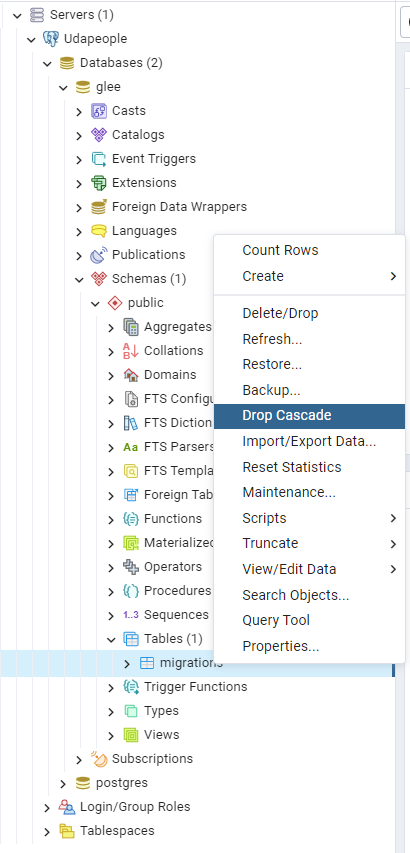
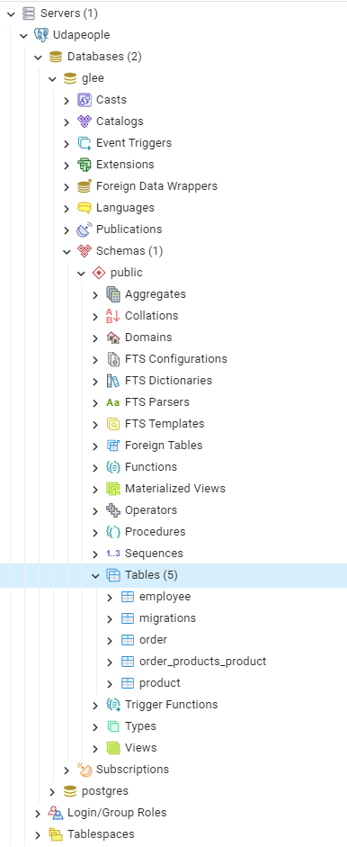

# Debugging `Connection Refused`

Connection refused error indicates that the host can be reached on the specified IP Address (DNS name) and Port, but there's no service running on the host listening to connection on the specified port

This can happen due to either the service has not started in the first place or it has terminated after multiple restarts

_Note_ All the following instructions will be conducted on the instance itself

## Ensuring the software is deployed correctly on the host

First things first, the following software has to be installed on the instance

- **Node.js** **v13.8.0**

  ```sh
  node --version
  # Should output: 13.8.0
  ```

- **NPM** **v6**

  ```sh
  npm --version
  # Should output: 6.x.x
  ```

  Where `x` can be any number, just the major version that matters

- **PM2**

  ```sh
  pm2 --version
  # Should output: a version number
  ```

If any of the previously mentioned software please refer to the **Configure Backend** section on my guide

## Checking PM2 logs

Second thing to do is to check the logs of PM2

```sh
pm2 logs
```

There are multiple possibilities for a failed running process, let's examine them

### Case 1: Misconfigured Environment Variables

One form of the log might be the following

```txt
...
PM2     | App [main:0] starting in -fork mode-
PM2     | App [main:0] online
0|main  | Error: Config validation error: "<Name of an Environment Variable>" is required
....
PM2     | App [main:0] exited with code [1] via signal [SIGINT]
```

This indicates that the process itself did not pick up the environment variables when `pm2` was launched in the `deploy` play

**How to solve?**

- First make sure to have set the all environment variables to the correct values in CircleCI configuration

  - _Note_ : Some environment variables (`TYPEORM_MIGRATIONS`, `TYPEORM_MIGRATIONS_DIR`, and `TYPEORM_ENTITIES`) has to be suitable for the production build of the application, refer to the section on **Environment Variables** on the guide concerning the **Deploy Backend** stage

- Second make sure to let **Ansible** pick the environment variables up from Circle CI while executing the Deploy play, refer to the section on Environment Variables while building the deploy-backend playbook in the guide

### Case 2: Misconfigured Database

The logs might indicate a running service

```
0|main     | debug: Mapped {/:id/names, PUT} route
0|main     | debug: Mapped {/:id/address, PUT} route
0|main     | debug: Mapped {/:id/displayName, PUT} route
0|main     | debug: Mapped {/:id/tags, PUT} route
0|main     | debug: Mapped {/:id/phoneNumber, PUT} route
0|main     | debug: Mapped {/:id/personalEmail, PUT} route
0|main     | debug: Mapped {/:id/companyEmail, PUT} route
0|main     | debug: Mapped {/:id/salary, PUT} route
0|main     | debug: Mapped {/:id/salaryType, PUT} route
0|main     | debug: Mapped {/:id/effectiveDate, PUT} route
0|main     | debug: Mapped {/:id/birthdate, PUT} route
0|main     | debug: Mapped {/:id/inactive, PUT} route
0|main     | debug: Mapped {/:id/active, PUT} route
0|main     | debug: Nest application successfully started
0|main     | debug: Listening on port 3030.
```

And the API status endpoint returns OK status

```
curl localhost:3030/api/status
```

But when requesting items from the database an error occurs

```sh
curl localhost:3030/api/orders
# or
curl localhost:3030/api/Employees
```

Throws an error message like this

```
{"statusCode":500,"message":"relation \"employee\" does not exist","stack":"QueryFailedError: relation \"employee\" does not exist    at new QueryFailedError (/udapeople-cicd/backend/src/error/QueryFailedError.ts:9:9)    at Query.callback (/udapeople-cicd/backend/src/driver/postgres/PostgresQueryRunner.ts:178:30)    at Query.handleError (/udapeople-cicd/backend/node_modules/pg/lib/query.js:142:17)    at Connection.connectedErrorMessageHandler (/udapeople-cicd/backend/node_modules/pg/lib/client.js:183:17)    at Connection.emit (events.js:321:20)    at Socket.<anonymous> (/udapeople-cicd/backend/node_modules/pg/lib/connection.js:125:12)    at Socket.emit (events.js:321:20)    at addChunk (_stream_readable.js:297:12)    at readableAddChunk (_stream_readable.js:273:9)    at Socket.Readable.push (_stream_readable.js:214:10)"}/
```

If you checked the error message closely, you will find that the line "relation \"RELATION\" does not exist"", which is a clear indicator that the database is misconfigured

This cause of this error happened earlier in the pipeline, specifically in the `run-migrations` stage, and the most probable cause is using a docker image that does not contain Node.js 13.8.0

**How to solve?**

- First check the run migrations stage, make sure it uses a compatible image that has Node.js 13.8.0 installed

  ```yml
  ...
  jobs:
      ...
      run-migrations:
          docker:
          - image: cimg/node:13.8.0
  ```

  Or

  ```yml
  ...
  jobs:
      ...
      run-migrations:
          docker:
          - image: cimg/base:stable
          steps:
              ...
              - install_nodejs # Command for installing nodejs version 13.8.0, check the guide for details
  ```

- Connect to the database and drop the migrations table, and any table that is present

  - Use pgAdmin to connect to the database using the credentials
  - Navigate to Servers > **Server Name** > Databases > **Database Name** > Schemas > Tables
  - Right-click on the **migrations** table and select **Drop Cascade**

    

- Rerun the pipeline, and make sure that all tables present in the database after successfully running the `run-migrations` stage

  
