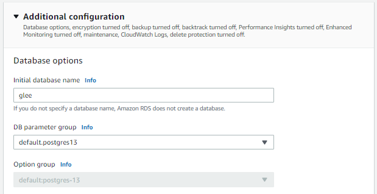

# Debugging Migrations and Database issues

## Environment Variables

While setting up the database we need to define a set of Environment Variables to ensure a smooth run, let's revisit them

According to [the sample](https://github.com/udacity/cdond-c3-projectstarter/blob/master/backend/.env.sample) provided by the starter code, the following variables have to be defined in the environment that runs the migrations script, which is in our case CircleCI

```
NODE_ENV=production
VERSION=1
TYPEORM_CONNECTION=postgres
TYPEORM_MIGRATIONS_DIR=./src/migrations
TYPEORM_ENTITIES=./src/modules/domain/**/*.entity.ts
TYPEORM_MIGRATIONS=./src/migrations/*.ts

TYPEORM_HOST=<RDS Instance Endpoint>
TYPEORM_PORT=5432
TYPEORM_USERNAME=<RDS Instance Username>
TYPEORM_PASSWORD=<RDS Instance Password>
TYPEORM_DATABASE=<The name of the Initial Database on RDS>
```

## Executor Environment

It's mandatory to use a docker image that has Node.js 13.8.0 installed on it

The migrations script has been tested with multiple versions of Node.js, and more than once the scrip exits gracefully with no errors and no migrations executed

Use docker image `cimg/node:13.8.0` for this stage in `.circleci/config.yml` file for the best compatibility between CircleCI and Node.js

```yml
jobs:
    ...
    run-migrations:
        docker:
        - image: cimg/node:13.8.0
        ...
```

## Errors during the migrations stage

### No connection options were found

**Standard Error Log**

You find the following lines in the error logs

```
...
Error during migration run:
Error: No connection options were found in any of configurations file.
...
```

**Cause**

**`TYPEORM_CONNECTION`** environment variable is not set properly

**Solution**

Set **`TYPEORM_CONNECTION`** environment variable to **`postgres`**

---

### Hostname not found: `ENOTFOUND`

**Standard Error Log**

You find the following lines in the error logs

```
Error during migration run:
Error: getaddrinfo ENOTFOUND xxxxxxxxxx
    at GetAddrInfoReqWrap.onlookup [as oncomplete] (dns.js:64:26) {
  errno: -3008,
  code: 'ENOTFOUND',
  syscall: 'getaddrinfo',
  hostname: 'xxxxxxxxxx'
}
```

**Cause**

The hostname set by the `TYPEORM_HOST` cannot be resolved into a valid IP address

**Solution**

Make sure to set the `TYPEORM_HOST` with the endpoint URL of the RDS instance, without any protocol prefixes

---

### Connection Timeout: `ETIMEDOUT`

**Standard Error Log**

You find the following lines in the error logs

```
Error: connect ETIMEDOUT xxxxxxxxxx:xxxx
    at TCPConnectWrap.afterConnect [as oncomplete] (net.js:1137:16) {
  errno: -110,
  code: 'ETIMEDOUT',
  syscall: 'connect',
  address: 'xxxxxxxxxx',
  port: xxxx
}
```

**Cause**

Timeout issues are typically associated with misconfigured firewall rules, in our case it's the **security group attached** on the RDS instance

**Solution**

The attached security group should have an inbound rule that allows TCP traffic on port 5432 from anywhere

It's better to create a dedicated security group for the RDS instance than editing the default security group

---

### Connection Refused: `ECONNREFUSED`

**Standard Error Log**

You find the following lines in the error logs

```
Error during migration run:
Error: connect ECONNREFUSED xxxxxxxxxx:xxxx
    at TCPConnectWrap.afterConnect [as oncomplete] (net.js:1137:16) {
  errno: -111,
  code: 'ECONNREFUSED',
  syscall: 'connect',
  address: 'xxxxxxxxxx',
  port: xxxx
}
```

**Cause**

The hostname is resolved, and the host can be reached on the specified port, however, the host does not run the service that listens for connection on this port, and as a result the connection is refused

In fact, this error is mainly due to incorrectly setting the `TYPEORM_HOST` variable to the DNS name of a host that is not the RDS instance, may it be the Public DNS of an EC2 instance or a localhost, both are incorrect values

**Solution**

Make sure to set the `TYPEORM_HOST` with the endpoint URL of the RDS instance, without any protocol prefixes

---

### Password Authentication Failure

**Standard Error Log**

You find the following lines in the error logs

```
Error during migration run:
error: password authentication failed for user "xxxxxxxxxx"
```

**Cause**

This error is pretty self-explanatory, the authentication credentials are incorrectly set in the environment variables `TYPEORM_USERNAME` and `TYPEORM_PASSWORD`

**Solution**

Make sure to set credentials environment variables (`TYPEORM_USERNAME` and `TYPEORM_PASSWORD`) to the values you set while creating the RDS instance

---

### Database does not exist

**Standard Error Log**

You find the following lines in the error logs

```
Error during migration run:
error: database "xxxxxxxxxx" does not exist
```

**Cause**

The database does not exist on the specified host

We can think of the RDS instance as a Virtual Machine (just like an EC2 instance) that is optimized to run the database engine software (PostgreSQL), this engine stores the data in a database defined in this engine

The cause of the issue is that the database that is being connected to (specified by the `TYPEORM_DATABASE`) is not found on the engine

**Solution**

When creating an RDS instance we have the option to create an initial database inside the engine



Under the card **Additional Configurations**, make sure to specify an Initial Database Name value, the value you set here is the database that will run on the engine. The backend app will pick up this value when you pass it as the environment variable `TYPEORM_DATABASE`

---

## Footnotes

In case you have faced another issue that is not present here, feel free to open an issue and contribute to this guide :D
