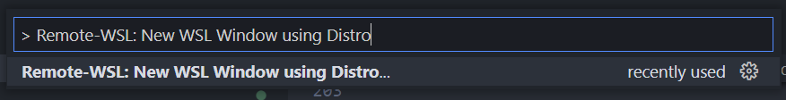
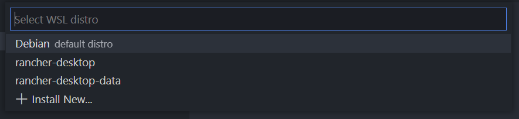
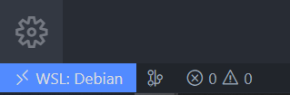

# Launching Local Development Environment

In the following instructions we will create a development environment to aid us developing the necessary steps

## Windows WSL

Steps:

- Enabling WSL on Windows
- Installing a suitable Distro
- Installing Python and Node.js
- Installing Remote Development VS Code Extension Pack

### Enabling WSL on Windows

Instructions can be found on the official WSL documentation from Microsoft [here](https://learn.microsoft.com/en-us/windows/wsl/install)

**Prerequisites**

You must be running Windows 10 version 2004 and higher (**Build 19041** and higher) or Windows 11

Check the version of the system with `systeminfo` command

```sh
systeminfo
```

Check the value of `OS Version`

```txt
...
OS Version: 10.0.19044 N/A Build 19044
...
```

If not the requirement is not met, kindly follow [Manual installation steps for older versions of WSL](https://learn.microsoft.com/en-us/windows/wsl/install-manual)

**Install WSL command**

You can now install everything you need to run Windows Subsystem for Linux (WSL) by entering this command in an **administrator** PowerShell or Windows Command Prompt and then restarting your machine

### Installing a suitable Distro

By default, the installed Linux distribution will be Ubuntu. This can be changed using the `-d` flag

- To change the distribution installed, enter: `wsl --install -d <Distribution Name>`. Replace `<Distribution Name>` with the name of the distribution you would like to install.

- To see a list of available Linux distributions available for download through the online store, enter: `wsl --list --online` or `wsl -l -o`.

- To install additional Linux distributions after the initial install, you may also use the command: `wsl --install -d <Distribution Name>`

Available Distros at the time of writing

```powershell
wsl --list --online
```

```txt
The following is a list of valid distributions that can be installed.
Install using 'wsl --install -d <Distro>'.

NAME            FRIENDLY NAME
Ubuntu          Ubuntu
Debian          Debian GNU/Linux
kali-linux      Kali Linux Rolling
openSUSE-42     openSUSE Leap 42
SLES-12         SUSE Linux Enterprise Server v12
Ubuntu-16.04    Ubuntu 16.04 LTS
Ubuntu-18.04    Ubuntu 18.04 LTS
Ubuntu-20.04    Ubuntu 20.04 LTS
```

I recommend installing either **Ubuntu** or **Debian** distros, both are pretty straightforward to begin with

To install Ubuntu

```powershell
wsl --install -d Ubuntu
```

To install Debian

```powershell
wsl --install -d Debian
```

After completing installation open the **Debian** (or **Ubuntu**) shell

```powershell
debian
# or
ubuntu
```

Execute the following command to avoid [this issue](https://stackoverflow.com/questions/51336147/how-to-remove-the-win10s-path-from-wsl)

```sh
sudo nano /etc/wsl.conf
```

And add the following lines

```conf
[interop]
appendWindowsPath = false
```

Save with `Ctrl + S` and exit with `Ctrl + X`

Exit the shell and return to Windows shell

Restart WSL

```powershell
wsl --shutdown
```

Then open a new shell
Next steps will be performed inside the WSL shell

### Installing required dependencies

We need some dependencies to be installed on our environment

To list a few:

- `bash`
- `curl`
- `unzip`
- `git`

```sh
sudo apt update
sudo apt install curl bash git unzip -y
```

### Installing AWS CLI v2

[AWS documentation](https://docs.aws.amazon.com/cli/latest/userguide/getting-started-install.html) provide the steps in one easy to copy and paste group based on whether you use 64-bit Linux or Linux ARM

```sh
curl "https://awscli.amazonaws.com/awscli-exe-linux-x86_64.zip" -o "awscliv2.zip"
unzip awscliv2.zip
sudo ./aws/install
```

#### Configuring AWS credentials

Use **permanent** user credentials to configure AWS CLI, **DO NOT** use AWS Cloud Gateway credentials as they are created to expire in 4 hours

```sh
aws configure

AWS Access Key ID [None]: <User Access Key ID>
AWS Secret Access Key [None]: <User Secret Access Key>
Default region name [None]: <Region>
Default output format [None]: json
```

### Installing Python and Node.js

In order to work with the source code, we need both Python and Node.js runtimes

#### Installing Python with pyenv

The [pyenv project](https://github.com/pyenv/pyenv) aims to allow us to easily switch between multiple versions of Python. It's simple, unobtrusive, and follows the UNIX tradition of single-purpose tools that do one thing well

**Installing pyenv with their official installer**

```sh
curl https://pyenv.run | bash
```

**Update `.bashrc`**

Add the following lines at the end of `~/.bashrc`

```sh
export PATH="$HOME/.pyenv/bin:$PATH"
eval "$(pyenv init --path)"
eval "$(pyenv virtualenv-init -)"
```

**Installing Python Build Dependencies**

[Install Python build dependencies](https://github.com/pyenv/pyenv/wiki#suggested-build-environment) before attempting to install a new Python version

```sh
sudo apt install make build-essential libssl-dev zlib1g-dev \
libbz2-dev libreadline-dev libsqlite3-dev wget curl llvm \
libncursesw5-dev xz-utils tk-dev libxml2-dev libxmlsec1-dev libffi-dev liblzma-dev -y
```

After completing the installation, exit the current shell and open a new shell

**Installing Python 3**

```
pyenv install 3:latest
```

It will take a while to complete the installation

_Note_: The last command actually builds Python 3 from its source code, in case you want to see the compilation output add `-v` at the end of the `pyenv install` command

**Activate the python installed version globally**

```sh
pyenv global $(pyenv versions --bare)
```

Now we have python 3 installed on our WSL environment

#### Installing Node.js and n

We can install the Node.js LTS version from [NodeSource](https://github.com/nodesource/distributions), then use [n](https://www.npmjs.com/package/n) as a version manager for Node.js versions

**Installing Node.js LTS via NodeSource**

```sh
# Using Ubuntu
curl -fsSL https://deb.nodesource.com/setup_lts.x | sudo -E bash -
sudo apt install -y nodejs
```

**Installing n version manager**

```sh
sudo npm install --location=global n
```

**Use n to install other versions of Node.js**

```sh
sudo n <The Needed Version>

# Example: sudo n 13.8.0
```

### Installing VS Code Remote Extension Pack

[Visual Studio Code Remote Development](https://code.visualstudio.com/docs/remote/remote-overview) allows you to use a container, remote machine, or the Windows Subsystem for Linux (WSL) as a full-featured development environment

[Remote Development on Visual Studio Marketplace](https://marketplace.visualstudio.com/items?itemName=ms-vscode-remote.vscode-remote-extensionpack)

- Tab `F1` to open the command pallet

- Type `>Remote WSL: New WSL Window using Distro`

  

- Select the installed WSL Distro you installed earlier

  

- A new VS Code Window will pop up, wait until VS Code installs server software on the distro

- After successfully completing installation, you can check that the current environment is indeed inside a WSL Distro you chose

  

- Now you can develop with VS Code inside the WSL environment
